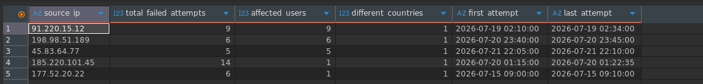

# Investigation 03 - Detecting Password Spraying Attempts

## Business Scenario

The Security Operations Center (SOC) requested an investigation to identify IP addresses responsible for multiple failed authentication attempts against different user accounts.

The objective is to detect behavior compatible with **Password Spraying**, **Brute Force**, or **User Enumeration**, allowing the security team to prioritize incident response.

---

## Objective

Identify suspicious source IP addresses that:

- Generated **5 or more failed authentication attempts**;
- Targeted one or more user accounts;
- Show indicators that justify further investigation.

The analysis should return:

- Source IP
- Number of failed authentication attempts
- Number of different usernames affected
- Number of countries observed
- First authentication attempt
- Last authentication attempt

---

## SQL Query

```sql
SELECT
    source_ip,
    COUNT(*) AS total_failed_attempts,
    COUNT(DISTINCT username) AS affected_users,
    COUNT(DISTINCT country) AS different_countries,
    MIN(login_time) AS first_attempt,
    MAX(login_time) AS last_attempt
FROM authentication_logs
WHERE status = 'FAILED'
    AND source_ip IS NOT NULL
    AND source_ip <> ''
    AND username IS NOT NULL
    AND username <> ''
GROUP BY source_ip
HAVING COUNT(*) >= 5
ORDER BY
    affected_users DESC,
    total_failed_attempts DESC;
```

---

## Query Result

> Insert a screenshot of the SQL query result here.



---

# Findings

The investigation identified multiple IP addresses with a high number of failed authentication attempts.

The most relevant findings were:

| Source IP | Failed Attempts | Affected Users | Possible Activity |
|------------|----------------:|---------------:|-------------------|
| 185.220.101.45 | 14 | 1 | Possible Brute Force |
| 91.220.15.12 | 9 | 9 | Possible Password Spraying |
| 198.98.51.189 | 6 | 6 | Possible User Enumeration |
| 177.52.20.22 | 6 | 1 | Repeated Password Attempts |
| 45.83.64.77 | 5 | 5 | Possible Credential Stuffing / Password Spraying |

---

## Risk Assessment

The observed behavior does not confirm a successful compromise.

However, the volume of failed authentication attempts, especially when targeting multiple user accounts, is compatible with common attack techniques including:

- Password Spraying
- Brute Force
- Credential Stuffing
- User Enumeration

These events should be prioritized for further investigation.

---

## Recommendations

Recommended next steps include:

- Verify IP reputation using services such as VirusTotal or AbuseIPDB.
- Correlate failed authentication attempts with successful logins.
- Review login locations and device fingerprints.
- Investigate authentication events within the SIEM.
- Monitor for recurring activity from the same IP addresses.
- Apply temporary IP blocking if malicious behavior is confirmed.

---

## Skills Demonstrated

- SQL Aggregation
- GROUP BY
- HAVING
- COUNT(DISTINCT)
- Date Analysis
- Security Log Investigation
- Authentication Analysis
- Threat Hunting
- Cybersecurity Reporting
